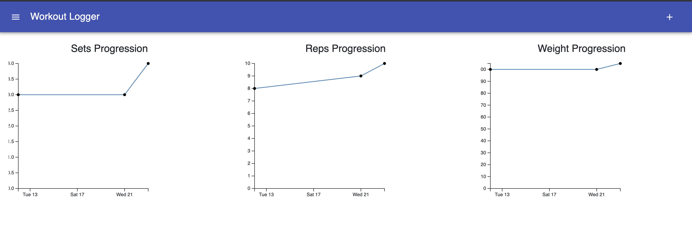

# Exercise Tracker

This application allows users to create exercises and group them into routines, log exercise performance, and visualize progress over time. 

## Visuals  

Users can create exercises:  

Then, these exercises can be grouped together into routines. 

After logging information about performance on an exercise, users can visualize their progress: 

## Installation 

### Server 

First install required libraries by running: 

`pip install -r requirements.txt`

An empty database needs to be created. First enter the python command line. Then run: 

`from app import db`
`db.create_all()`

Exit the python command line then run 
`python3 app.py`

to start the server locally on localhost:127.0.0.1

### Client 

Enter the client folder and run: 

`npm install`

then 

`npm start`. 

The application should open on localhost:3000

